# Proyecto MASB-POT-S-NOPUCMES

<!--

Lluís Colomer Coll: [https://www.linkedin.com/in/llu%C3%ADs-colomer-coll-52747b17b/](https://www.linkedin.com/in/lluís-colomer-coll-52747b17b/) 

Adrià Díaz Ferrero:[ https://www.linkedin.com/in/adrian-diaz/](https://www.linkedin.com/in/adrian-diaz/)

Francisco Domingo Gil: https://www.linkedin.com/in/francisco-domingo-219b99172/ 

-->

 

Lluís Colomer, Fran Domingo y Adrià Díaz (*NoPucMes*).

En este informe se describirá el proyecto final de la asignatura de *Microcontroladores para Aplicaciones y Sistemas biomédicos* sobre la programación de un potenciostato para la realización de dos tipos de mediciones electroquímicas: la *cronoamperometría* y la *voltametría cíclica*. Al final del proyecto, se realizarán diversas mediciones para validar el proyecto en una muestra de [ferricianuro de potasio](https://es.wikipedia.org/wiki/Ferricianuro_de_potasio) a diferentes concentraciones en un tampón (*buffer*) de [cloruro de potasio](https://es.wikipedia.org/wiki/Cloruro_de_potasio).

El proyecto se ha desarrollado mediante la programación de una placa STM32 Nucleo-F401RE en el entorno de programación STM32CubeIDE. Mediante Git se ha realizado un control de versiones de todo el código desarrollado y en GitHub lo hemos podido almacenar para compartirlo con el resto del equipo / gestor del proyecto. A continuación podemos encontrar una breve descripción de todos los elementos relevantes para el desarrollo del proyecto.

## Potenciostato

El potenciostato es un dispositivo electrónico requerido para controlar una celda de tres electrodos y ejecutar experimentos electroanalíticos. Es capaz de medir y controlar el potencial de una celda, detectando cambios en su resistencia. El sistema funciona manteniendo el potencial del electrodo de trabajo (WE) a un nivel constante respecto al potencial del electrodo de referencia (RE) mediante el ajuste de la corriente en un electrodo auxiliar (CE). Aplicando un potencial a una cierta superficie, la cantidad de electrones de su superficie se reduce o aumenta. Esto causa que el líquido contenga o consuma electrones para compensar esa diferencia.

 

> Esquema de al electrónica de un potenciostato. [Fuente](https://es.wikipedia.org/wiki/Potenciostato) de la imagen.

## Cronoamperometría

La [cronoamperometría](https://en.wikipedia.org/wiki/Chronoamperometry) (CA) es una **técnica electroquímica** en la cual el potencial del electrodo de trabajo (WE) se escalona y se mide la corriente resultante de los procesos farádicos que ocurren en la muestra. Este proceso se basa en monitorizar la corriente de la celda en función del tiempo, la cual fluctuará de acuerdo con la difusión del analito en la solución. Esto nos permitirá cuantificar la concentración del analito de interés. La cronoamperometría puede usarse para medir la dependencia entre la corriente y el tiempo actual para el proceso de difusión controlada que ocurre en un electrodo, que varía con la concentración de analito. Es un proceso mucho más simple en el que únicamente se fija un potencial inicial, el cual se amplía hasta que se produce la reacción. La señal de respuesta es una curva intensidad-tiempo. Para más información sobre esta técnica se puede consultar la siguiente [página](https://es.scribd.com/document/264324581/CRONOAMPEROMETRIA).

<a href="Docs/assets/Chronoamperometry.jpg">
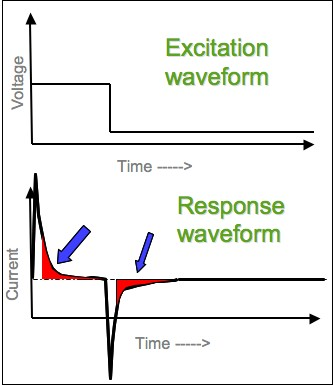
</a>

> Imagen donde se puede ver el cambio de voltaje que se genera y la forma de la curva de respuesta. Como hemos visto anteriormente, la curva de respuesta es en función de la *Corriente* y el *tiempo*, en cambio la de excitación es en función del *voltaje* y el *tiempo*. [Fuente](https://en.wikipedia.org/wiki/Chronoamperometry) de la imagen.

## Voltametría cíclica

La [voltametría cíclica](https://chem.libretexts.org/Bookshelves/Analytical_Chemistry/Supplemental_Modules_(Analytical_Chemistry)/Instrumental_Analysis/Cyclic_Voltammetry) (CV) es un tipo de medida [electroquímica](https://en.wikipedia.org/wiki/Electrochemistry) [potenciodinámica](https://en.wikipedia.org/wiki/Voltammetry) que mide la corriente que se desarrolla en una celda electroquímica en condiciones en las que el voltaje supera el predicho por la ecuación de Nernst. La CV se obtiene realizando ciclos en el potencial de un electrodo de trabajo y midiendo la corriente resultante. Para más información sobre la técnica se puede consultar la siguiente [página](https://chem.libretexts.org/Bookshelves/Analytical_Chemistry/Supplemental_Modules_(Analytical_Chemistry)/Instrumental_Analysis/Cyclic_Voltammetry).

<a href="Docs/assets/CV_excitation_signal.jpg">
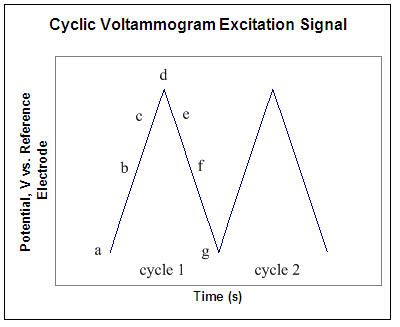
</a>

> Señal de excitación para realizar la voltametría cíclica (realizando dos ciclos). [Fuente](https://chem.libretexts.org/Bookshelves/Analytical_Chemistry/Supplemental_Modules_(Analytical_Chemistry)/Instrumental_Analysis/Cyclic_Voltammetry) de la imagen.

## Aplicación viSens-S

Para enviar y recibir la información del microcontrolador hemos utilizado una aplicación de LabVIEW llamada **viSens-S**, la cual nos permite la comunicación con el microcontrolador tanto para enviar la selección del usuario (CA y CV y los respectivos parámetros) como para recibir los datos de la medida CA o CV. A continuación dejamos el [repositorio](https://github.com/Albert-Alvarez/viSens-S/releases/latest) de GitHub para descargar la aplicación.

## Tabla de Contenidos

- [Introducción](#Proyecto-MASB-POT-S-NOPUCMES)
  - [Potenciostato](#Potenciostato)
  - [Cronoamperometría](#Cronoamperometría)
  - [Voltametría Cíclica](#Voltametría-Cíclica)
  - [Aplicación viSens-S](#Aplicación-viSens-S)
- [Objetivos](#Objetivos)
- [Técnicas a implementar](#Técnicas-a-implementar)
  - [Implementación Cronoamperometría](#Implementación-Cronoamperometría)
    - [Diagrama de Flujo (CA)](#Diagrama-de-Flujo-(CA))
  - [Implementación Voltametría Cíclica](#Implementación-Voltametría-Cíclica)
    - [Diagrama de Flujo (CV)]([#Diagrama-de-Flujo-(CV)])
  - [Diagrama de flujo de la Aplicación](#Diagrama-de-flujo-de-la-Aplicación) 
  - [Diagrama de flujo del Microcontrolador](#Diagrama-de-flujo-del-Microcontrolador)
- [Desarrollo del Proyecto](#Desarrollo-del-Proyecto)
  - [Componentes del proyecto](#Componentes-del-proyecto)
    - [Power Management Unit](#Power-Management-Unit)
    - [Relé](#Relé)
    - [Potenciostato y ADC](#Potenciostato-y-ADC)
  - [Configuración del microcontrolador](#Configuración-del-microcontrolador)
  - [Funciones previas](#Funciones-previas)
  - [Función para la Cronoamperometría](#Función-para-la-Cronoamperometría)
  - [Función para la Voltametría Cíclica](#Función-para-la-Voltametría-Cíclica)
- [Resultados Obtenidos](#Resultados-Obtenidos)
- [Conclusiones](#Conclusiones)

## Objetivos

- Programar un potenciostato con STM32CubeIDE.
- Realizar una cronoamperometría y una voltametría cíclica.
- Configurar el microcontrolador para recibir y entender los datos que envía la aplicación sobre la técnica escogida por el usuario.
- Permitir la comunicación bidireccional entre el microcontrolador y la aplicación viSens-S.
- Mostrar los datos captados a través de la aplicación viSens-S.
- Efectuar una verificación técnica utilizando un potenciómetro.
- Realizar un control de versiones con [git](https://git-scm.com/) y [GitHub](https://github.com/).

## Técnicas a implementar

### Implementación Cronoamperometría

Esta técnica es la consiste en la aplicación de un voltaje durante cierto intervalo de tiempo en la celda y el registro de la corriente resultante. La implementación de esta técnica se basa en fijar la tensión de la celda electroquímica a un valor concreto y realizar las medidas de VCELL(REAL) y ICELL a diferentes tiempos, como podemos ver en el [diagrama de flujo](#Diagrama-de-Flujo-(CA)). Posteriormente solo se tienen que enviar los datos al *host*. Cada vez que se realiza una medición se debe enviar la siguiente información: **punto** en el que nos encontramos, **tiempo** en segundos en el que se realiza la medición y por último, el **voltaje** y la **intensidad** medidos, VCELL(REAL) y ICELL respectivamente.

#### Diagrama de Flujo (CA)

El siguiente diagrama de flujo es el que hemos realizado para la implementación de la cronoamperometría. 

> Diagrama de flujo de la función implementada para la cronoamperometría.

### Implementación Voltametría Cíclica

Técnica electroquímica, popularmente usada para investigar sobre los procesos de reducción y oxidación de especies moleculares. Como hemos visto anteriormente, en esta técnica el potencial del electrodo de trabajo (WE) es variado *linealmente* respecto al tiempo, partiendo de un potencial inicial, hasta que el **primer potencial objetivo es alcanzado**. Seguidamente, se hace un barrido de potencial linealmente en el sentido opuesto para alcanzar el **segundo potencial objetivo**, pasando por el *potencial inicial*. Toda esa variación de potencial viene recogida en el eje X de una [figura típica de voltametría cíclica](https://www.ossila.com/pages/cyclic-voltammetry). El eje Y recoge la respuesta de este sistema al potencial aplicado, mediante el paso de corriente. 

<a href="Docs/assets/CV_example.png">
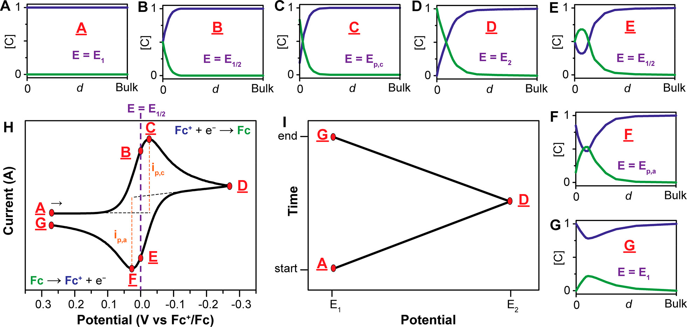
</a>

> Figura típica de voltametría cíclica. [Fuente](https://pubs.acs.org/doi/10.1021/acs.jchemed.7b00361) de la imagen.

En esta figura podemos observar paso a paso el comportamiento de esa voltametría. En la primera etapa (A) vemos como aunque varíe el potencial, el corriente se mantiene estable. Cuando entramos en la etapa B, la variación de corriente sufre un incremento exponencial, por una pequeña variación de potencial. En la etapa C llegamos al pico de corriente, y hasta llegar a la D sufrimos un decrecimiento exponencial hasta llegar al primer potencial objetivo (D). Toda esta etapa corresponde al proceso de reducción, el Fc+ gana electrones (e-) convirtiéndose en Fc.

Del punto D al punto G, hacemos un barrido del primer al segundo potencial objetivo en un proceso inverso al descrito anteriormente. En ese tramo se lleva a cabo el proceso de oxidación. El Fc pierde un electrón, volviéndose Fc+ + e-.

Finalmente, para entender el porqué de esa forma tan característica, nos remitimos a la **Ecuación de Nernst**, la cual describe el equilibrio entre dos especies.

<a href="Docs/assets/formula_1.png">
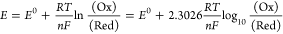
</a>

Si estudiamos el ejemplo concreto del ferrocenium (Fc+) y el ferrocene (Fc), reducción de un electrón, podemos reemplazar la ecuación anterior por la siguiente:

<a href="Docs/assets/formula_2.png">
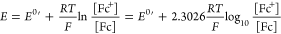
</a>

La ecuación de Nernst nos proporciona una potente manera de predecir la respuesta del sistema delante de un cambio de concentraciones en las especias o un cambio de potencial en el electrodo potencial. Así pues, cuando el potencial es escaneado durante una voltametría cíclica, la concentración de las especies alrededor del electrodo varían en función del tiempo, de acorde a la ecuación de Nernst.

*[Fuente](https://pubs.acs.org/doi/10.1021/acs.jchemed.7b00361) de la información y de las fórmulas, consultar para más información sobre esta técnica.*

#### Diagrama de Flujo (CV)

El siguiente diagrama de flujo corresponde a la voltametría cíclica. Podemos ver como el flujo corresponde a la explicación previa del la técnica y como vamos variando `vObjetivo` a los diferentes vértices que hemos visto en la figura anterior. Cada vez que se realiza una medición, por tanto que incrementamos VCELL con `eStep`, se debe enviar la siguiente información: **punto** en el que nos encontramos, **tiempo** en segundos en el que se realiza la medición y por último, el **voltaje** y la **intensidad** medidos, VCELL(REAL) y ICELL respectivamente. Cycles == número total de ciclos

<a href="Docs/assets/CV_flux.png">
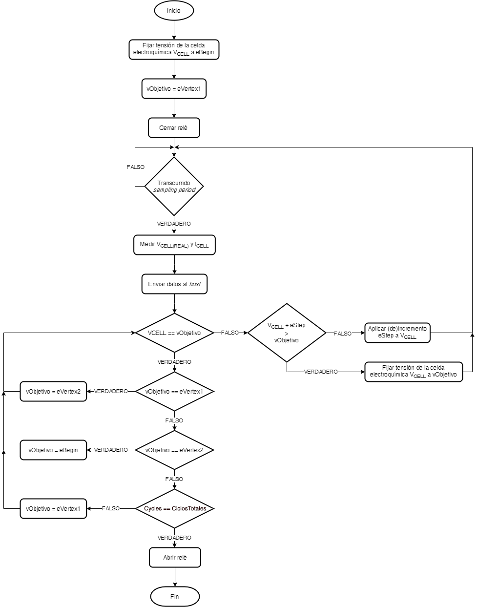
</a>

> Diagrama de flujo de la función implementada para la voltametría cíclica.

### Diagrama de flujo de la Aplicación

El siguiente flujo muestra la operativa del usuario con la aplicación [viSens-S](https://github.com/Albert-Alvarez/viSens-S/releases/latest) y su interacción con nuestro dispositivo. El usuario configurará la aplicación y iniciará la medida y entonces será el dispositivo el que tomará los diferentes puntos y los enviará a la aplicación. 

> Diagrama de flujo de la aplicación.

### Diagrama de flujo del Microcontrolador

Para el diagrama de flujo del microcontrolador hemos creado un diagrama específico para nuestro código con la herramienta [draw.io](http://draw.io/).

<a href="Docs/assets/MICRO.png">
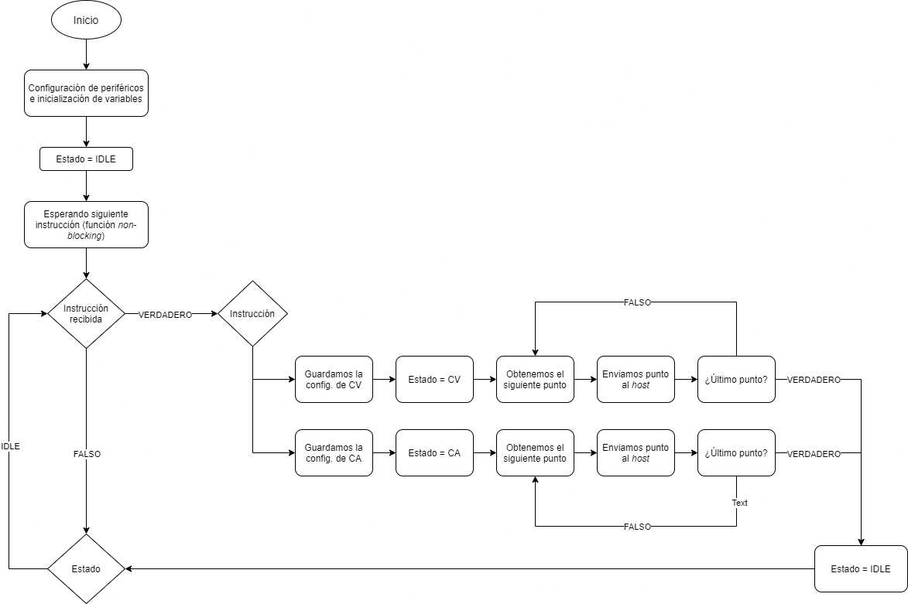
</a>

> Diagrama de flujo del microcontrolador implementado en el proyecto.

## Desarrollo del Proyecto

Para el desarrollo del proyecto se han creado diversas ramas desde `develop/project` para cada una de las funcionalidades que queríamos implementar. A continuación tenemos una lista con las diferentes ramas y su funcionalidad.

- **`develop/project`**: Configuración del archivo `.ioc` y generación del código. Los cambios de configuración del archivo `main.c` y `.ioc` se realizaron desde esta rama.
- **`feature/stm32main`**: Creación y configuración de las funciones `setup()` y `loop()`. En esta rama creamos los archivos `header` y `source` de *stm32main* ubicado en la carpeta de **components**.
- **`feature/timer`**: Gestión de la función ISR que se activa cuando el *timer* completa un periodo. En esta rama creamos los archivos `header` y `source` del *timer* ubicado en la carpeta de **components**.
- **`feature/chronoamperometry`**: Gestión de la cronoamperometría. En esta rama creamos los archivos `header` y `source` de *chronoamperometry* ubicado en la carpeta de **components**.
- **`feature/voltammetry`**: Gestión de la voltametría cíclica. En esta rama creamos los archivos `header` y `source` de *cyclic_voltammetry* ubicado en la carpeta de **components**.
- **`feature/prueba-crono`**: Gestión de la cronoamperometría completa, gestionando el resto de *features*. En esta rama hemos juntado todas las ramas anteriores (excepto la de voltametría) y configurado esta técnica.
- **`feature/prueba-volta`**: Tras completar el cronoamperometría en la rama anterior se ha realizado la gestión de la *voltametría cíclica* completa, gestionando el resto de *features*. Esta rama se ha creado a partir de la rama anterior, por tanto encontramos también implementada la cronoamperometría. Sobre esta rama hemos configurado y completado la voltametría.

Por último, se han realizado varias ramas `feature/**` donde se han probado las funcionalidades juntas y se han corregido los diferentes errores de código. Cuando el código ha sido correcto, se ha implementado ese código en la rama `develop/project`. 

La elaboración de los diferentes archivos se han realizado mayoritariamente a través de videollamadas por lo que los tres componentes del grupo han estado presentes en los diferentes *commits* y *pull requests* realizados en las ramas. Cada integrante ha realizado el diseño de cada rama *feature* de manera teórica y, posteriormente y de manera conjunta, se han implementado en STM32CubeIDE teniendo en cuenta el diseño teórico de cada integrante del grupo.

### Componentes del proyecto

#### *Power Management Unit*

Este componente es la unidad de gestión de la potencia. Será el encargado de alimentar todo el *front-end* durante las mediciones. Inicialmente deberá estar deshabilitada para evitar consumo de corriente y en el momento que el microcontrolador negocie con el ordenador un consumo máximo está se deberá habilitar. Esta unidad se controlará a través del pin `EN` que veremos en la configuración.

#### *Relé*

Este componente será el encargado de cerrar y abrir nuestro circuito. Funciona como un interruptor entre el *front-end* y el sensor. Cuando el relé esté abierto (estado por defecto), el circuito estará abierto y no habrá conexión (por lo que no se podrán hacer mediciones). Cuando queramos realizar una medición deberemos cerrar el relé y posteriormente, cuando finalice volverlo a abrir. Esta unidad se controlará a través del pin `RELAY`.

#### *Potenciostato y ADC*

El potenciostato es el responsable de polarizar la celda electroquímica a una tensión VCELL y leer la corriente que circula por ella ICELL. 

Además utilizaremos el ADC del microcontrolador para leer la tensión real que estamos aplicando y para calcular VCELL y ICELL.

### Configuración del microcontrolador

| Pin  | Alias |         Tipo         | Descripción                                                  |
| :--: | :---: | :------------------: | :----------------------------------------------------------- |
| PA0  | VREF  |  Entrada analógica   | Tensión absoluta del *Reference Electrode (RE)* VREF utilizada para la medición de VCELL. |
| PA1  | ICELL |  Entrada analógica   | Tensión de salida del TIA utilizada para la medición de ICELL. |
| PB8  |  SCK  | I2C (SCK) | Señal SCK del I2C. Con el bus I2C se controla el DAC del *front-end*. |
| PB9  |  SDA  | I2C (SDA) | Señal SDA del I2C. Con el bus I2C se controla el DAC del *front-end*. |
| PA5  |  EN   |    Salida digital    | Señal de (des)habilitación de la PMU. `0`: PMU deshabilitada. `1`: PMU habilitada. |
| PB5  | RELAY |    Salida digital    | Señal de control del relé. `0`: Relé abierto. `1`: Relé cerrado. |

> [Fuente](https://github.com/Biomedical-Electronics/masb-pot-s-nopucmes) de la tabla utilizada para configurar el microcontrolador.

### Funciones previas

- **STM32main:**

En el fichero `stm32main.c` hemos creado las funciones de `setup()` y `loop()`. Primeramente en el `setup` lo que haremos será habilitar la PMU y configurar la comunicación I~2~C, el potenciómetro y la DAC. Por otro lado, en la función `loop` la cual se ejecutará de manera continua (ya que está dentro del bucle `while` en el archivo `main.c`) encontramos un condicional que en caso de recibir un mensaje entrará en el bucle. En función de que comando se haya recibido se entrará en un caso o en otro. Dentro de cada técnica encontramos un primer comando de configuración, el cual nos permite pasar del valor en hexadecimal que envía la aplicación y que recibimos a los valores de cada variable que ha configurado el usuario. Esto lo realizamos haciendo una [decodificación en COBS](https://blog.mbedded.ninja/programming/serialization-formats/consistent-overhead-byte-stuffing-cobs/). Seguidamente, configuramos la técnica con los valores previamente obtenidos y obtenemos los valores. Ambas funciones se especificarán más adelante en la sección correspondiente a la [cronoamperometría](#Función-para-la-Cronoamperometría) y a la [voltametría cíclica](#Función-para-la-Voltametría-Cíclica).

- **Timer:**

El archivo `timer.c` está formado básicamente por la función [ISR](https://en.wikipedia.org/wiki/Interrupt_handler), cuando el microcontrolador recibe una interrupción, deja de ejecutar el código que esté procesando en ese momento y pasa a ejecutar el código que hayamos asociado a esa interrupción.

En nuestro caso hemos utilizado el *timer 2* (`TIM2`) el cual tiene un contador de 32 bits y nos permite no tener que configurar un [preescalado](https://www.prometec.net/timers/) y utilizar directamente un periodo de 84,000. Dentro de la función `Callback` tenemos que en función de la variable `estado` entraremos en una parte del código u otra. En el caso de estar en la cronoamperometría, la variable estado será igual a `CA` por lo que activaremos la medición de valores de la cronoamperometría como veremos más adelante. De la misma manera si estamos realizando una voltametría, la variable `estado` será igual a `CV` por lo que activaremos esa medición.

### Función para la Cronoamperometría

El desarrollo de la función para la cronoamperometría está basado en el diagrama de flujo anteriormente mostrado. Como ya se ha explicado anteriormente, en la cronoamperometría medimos la intensidad de corriente que pasa a través de una celda tras haberle fijado un voltaje. Como no estamos en un dispositivo perfecto e ideal, este voltaje que hemos enviado tendrá pequeñas variaciones, por tanto es importante medirlo para saber el valor real. Este voltaje se mide utilizando el ADC del microcontrolador. El valor medido se obtiene aislando Vseñal de la siguiente fórmula.

Nuestro microcontrolador tiene una resolución de 12 bits por lo que la fórmula se puede expresar de la siguiente manera:

Con Vseñalpodemos calcular el Voltaje en la celda usando la siguiente fórmula:

> Siendo Vseñal = VADC

Y la intensidad de corriente viene definida por la siguiente fórmula:

Sin embargo, V~ADC~ en VCELL no es el mismo que V~ADC~ en ICELL, por lo que hay que medir dos valores distintos y usar el ADC~value~ correspondiente para cada uno. Tras esta idea general del funcionamiento de la cronoamperometría, vayamos a ver su implementación real. Para ello hemos utilizado una interrupción del timer, incluida en el archivo `timer.c`, y dos funciones que se encuentran en el archivo `chronoamperometry.c`.

En la interrupción controlamos únicamente una variable que es la encargada de iniciar la medida de la cronoamperometría. Las dos funciones son `Chronoamperometry_Config` y `Chronoamperometry_Value`. En la primera se cierra el relé, se configura el ADC, el timer, se fija el valor de VCELL como eDC y se envía la petición de hacer una cronoamperometría. Por otro lado, en la segunda función se llevan a cabo todas las mediciones. Para ello es necesario, primero de todo, detectar el tiempo total de medida pedido por el usuario. A continuación, se inicia la conversión, y se mide VCELL e ICELL. Tras ello enviamos el punto inicial, que corresponde a tiempo 0, y los valores medidos de VCELL e ICELL; e iniciamos el timer. Tras el envío, sumamos un punto a `pointCA`, esta variable se encarga de controlar el número de puntos pedidos por el usuario. Además al enviar cada punto, y por tanto cumplir un periodo, se sumará un `samplingPeriod` a la variable `counter`.

Para el resto de medidas es necesario hacer un bucle `while`, el cual se mantendrá activo hasta que la variable de control llamada `counter`, sea superior al tiempo total de medida configurado por el usuario. Dentro de este bucle `while` encontramos un bucle `if`, que se activa si la variable bandera es `TRUE`, esta variable únicamente es así cuando se activa la **función ISR** del timer. En él encontramos una vez más las funciones que inician la conversión, las medidas de VCELL e ICELL y su envío al host.

### Función para la Voltametría Cíclica

El desarrollo de la función en este caso, está basado en el **workflow** de la voltametría cíclica, y en el propio concepto de voltametría en sí. Es decir, en términos generales, pretendemos dar un voltaje inicial al electrodo de trabajo (WE). Hacer un barrido creciente de voltaje hasta llegar al potencial objetivo 1 (`eVertex1`). Una vez ahí, hacer un barrido decreciente de voltaje hasta llegar al potencial objetivo 2 (`eVertex2`). I de ahí, volver a hacer un barrido creciente de potencial hasta llegar al objetivo. Este procedimiento lo repetiremos tantas veces como ciclos nos indique el usuario. I los datos serán enviados al host cada vez transcurra el *sampling period* indicado, por lo que activaremos el sensor y este nos devolverá la medida de VCELL REAL y ICELL.

Esto a modo de idea general. Haciendo el barrido de potencial indicado, si el funcionamiento es el esperado, obtendremos la típica curva tan característica de la voltametría cíclica. Pero vamos por partes, que probablemente se va a entender mejor. Dentro de la rama creada bajo el nombre de **`feature/voltammetry`**, hemos definido dos funciones distintas dentro del fichero **`cyclic_voltammetry.c`**, que puede encontrarse en el directorio `../Core/Src/components`. 

La primera es una función llamada _Voltammetry_Config_, que pretende ejecutarse una única vez una vez el host envía la indicación de que desea realizar una voltametría cíclica. Dentro de esta cerramos el relé para poder llevar a cabo las distintas mediciones, fijamos el valor de VCELL al voltaje inicial deseado por el usuario (`eBegin`), y definimos el período de sampleo del timer, como el cociente entre `eStep` y `scanRate`.

La segunda función es la que engloba la mayor parte del proceso, dónde se va a llevar a cabo el barrido de potencial y dónde se tomarán las distintas medidas que se enviarán al host. Empezamos inicializando el timer, fijando el VCELL a eBegin y el voltaje objetivo al deseado por el usuario (introducido como input en eVertex1). Definimos también una variable llamada measure como `FALSE`, esta nos permitirá obtener el control sobre cada vez que el timer se active y realice una medida.

La segunda función _Volatmmetry Value_ es la que engloba la mayor parte del proceso, dónde se va a llevar a cabo el barrido de potencial y dónde se tomarán las distintas medidas que se enviarán al host. Empezamos inicializando el timer, fijando el VCELL a `eBegin` y el voltaje objetivo al deseado por el usuario (introducido como input en eVertex1). Definimos también una variable llamada `measure` cómo `FALSE`, esta nos permitirá obtener el control sobre cada vez que el *timer* se active y realice una medida. Cerramos el relé y empezamos la voltametría. Cada vez que transcurre el sampling period, medimos VCELL y ICELL y enviamos los datos al host. Mientras VCELL no sea igual al potencial objetivo definido aplicamos un incremento eStep. Vamos procediendo de este modo hasta llegar al potencial objetivo. Una vez llegado a este punto fijamos como nuevo objetivo `eVertex2` (definido también por el usuario cómo input). Tomamos medidas y aplicamos variaciones eStep cada vez que transcurre el *sampling period*. Hasta llegar a `eVertex2`, dónde definimos como objetivo eBegin. Llegados a eBegin, si se ha llegado al número de ciclos definido como input, paramos la medida y abrimos relé. En caso contrario procedimos a un nuevo ciclo siguiendo el mismo procedimiento descrito anteriormente.

## Resultados Obtenidos

Se ha realizado la implementación de ambas técnicas utilizando un potenciómetro, una validación técnica previa a la prueba final y, por último, se han realizado diversas mediciones para validar el proyecto en una muestra de [ferricianuro de potasio](https://es.wikipedia.org/wiki/Ferricianuro_de_potasio) a diferentes concentraciones en un tampón (*buffer*) de [cloruro de potasio](https://es.wikipedia.org/wiki/Cloruro_de_potasio). Continuación se pueden revisar los resultados que hemos obtenido en ambas técnicas:

### Cronoamperometría

- *Potenciómetro*

Realizando una medición cada 500ms y variando el valor de la resistencia variable con el potenciómetro obtuvimos los siguientes resultados:

<a href="Docs/assets/Resultados_Crono.png">
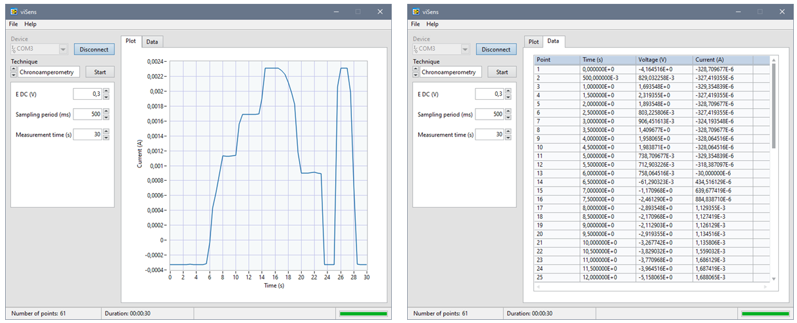
</a>

	

- *Validación técnica*

Realizando una medición cada 100ms y fijando una tensión de VCELL de 0,5 V hemos obtenido los siguiente resultados, donde la corriente estaba entorno a 2,3E-5 amperios.  

<a href="Docs/assets/Resultados_CA_validacion.png">
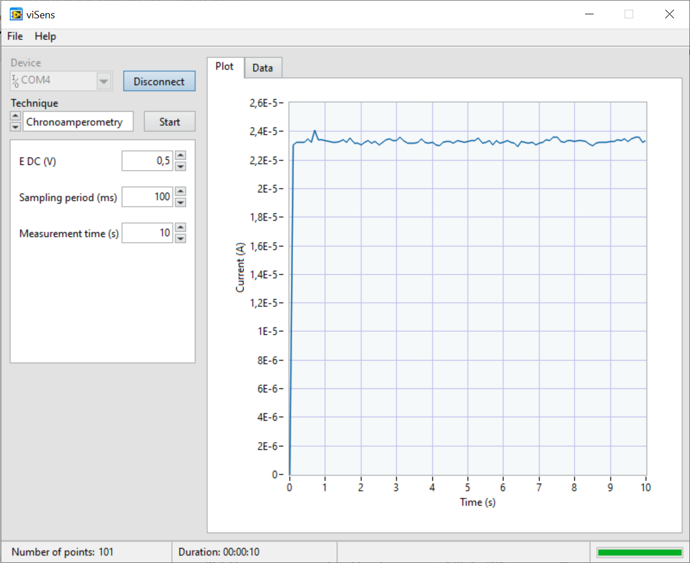
</a>

- *Resultados con una muestra de ferricianuro de potasio a diferentes concentraciones en un tampón de cloruro de potasio*

Por último, se realizó la prueba final efectuando ambas mediciones en una solución de ferricianuro de potasio a dos concentraciones diferentes en un tampón de cloruro de potasio. A continuación, podemos ver la placa con la que se han realizado las mediciones y los gráficos de la cronoamperometría obtenidos. El gráfico del medio corresponde a una concentración 1 mM y el de la derecha a una concentración 5 mM.

<a href="Docs/assets/Resultados_CA_final.png">
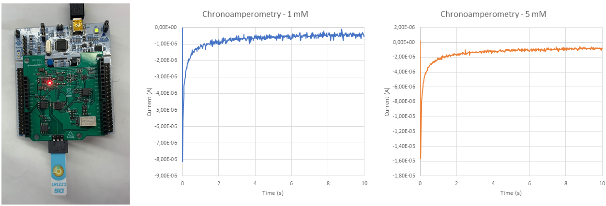
</a>

### Voltametría Cíclica

- *Potenciómetro*

También hemos realizado la prueba para ver si el envío de puntos y el *timer* funcionaban correctamente. En la siguiente imagen podemos ver las condiciones de ambas pruebas y los resultados que hemos obtenido. Como podemos ver ambas pruebas tienen una configuración diferente y realiza todos los puntos.

<a href="Docs/assets/Resultados_Volta.png">
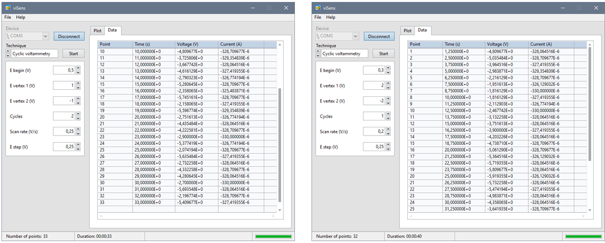
</a>

- *Validación técnica*

De la misma manera, también se ha realizado una validación técnica de la voltametría cíclica, fijando el punto inicial a 0V, el vértice 1 a 0.6V, el vértice 2 a -0.6V y dos ciclos. Los resultados obtenidos son los siguientes donde vemos que el potencial llega a ambos vértices de la voltametría y para ambos ciclos los resultados son muy similares.

<a href="Docs/assets/Resultados_Crono.png">
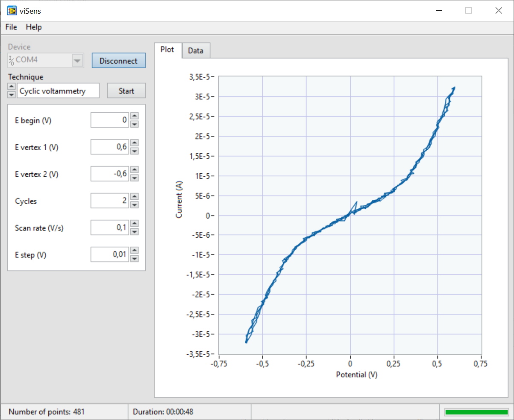
</a>

- *Resultados con una muestra de ferricianuro de potasio a diferentes concentraciones en un tampón de cloruro de potasio*

Por último, se realizó la prueba final efectuando ambas mediciones en una solución de ferricianuro de potasio a dos concentraciones diferentes en un tampón de cloruro de potasio. A continuación, podemos ver la placa con la que se han realizado las mediciones y los gráficos de la voltametria cíclica obtenidos. El gráfico del medio corresponde a una concentración 1 mM y el de la derecha a una concentración 5 mM. Los gráficos corresponden a 3 cíclos.

<a href="Docs/assets/Resultados_CV_final.png">
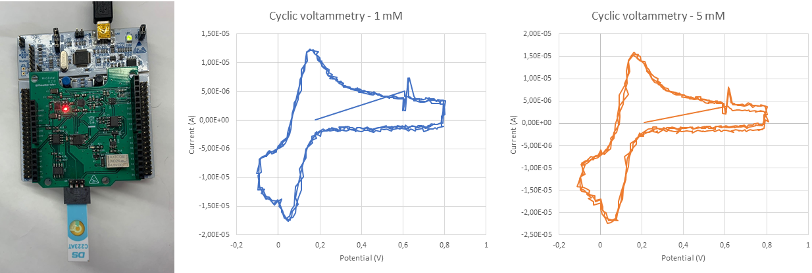
</a>

## Conclusiones

En este proyecto se ha implementado con éxito la programación de un potenciostato con STM32CubeIDE para llevar a cabo la ejecución de una **cronoamperometría** y una **voltametría cíclica**. Para realizar ambas técnicas, se ha configurado el microcontrolador de la placa de evaluación STM32 Nucleo-F401RE para recibir y entender los datos que envía el usuario a través de la aplicación viSens-s, permitiendo así una comunicación bidireccional entre el microcontrolador y esta. Los datos captados en la ejecución de las técnicas se han enviado a la aplicación, la cual muestra tanto los datos *raw* como una representación gráfica de los resultados.  Para permitir la comunicación entre el microcontrolador y la aplicación se ha realizado la codificación y decodificación de la información a través del **protocolo de comunicación COBS**.

En este proyecto, hemos tenido la oportunidad de desarrollar gran parte de los conocimientos adquiridos a lo largo de la asignatura para la programación de microcontroladores. A lo largo del proyecto se han utilizado diversos periféricos del microcontrolador como los *timers* y con sus respectivas **interrupciones**, los GPIOs, la comunicación serie síncrona (I^2^C) y asíncrona (UART) y los conversores analógicos digitales (ADCs) para la realización de aproximaciones discretas.

Para la coordinación del trabajo entre los distintos miembros del grupo, se ha usado la herramienta Git y la plataforma GitHub, dónde se ha llevado a cabo el desarrollo del proyecto a través de la creación de distintas ramas. Además, también nos ha permitido tener un control de las versiones de nuestro código y poder trabajar en paralelo desarrollando diferentes ramas.

Por último se han realizado diversas pruebas tanto con una placa de pruebas como con un potenciostato para realizar una verificación técnica previa a la implementación final. Las diversas pruebas han tenido un resultado satisfactorio y han realizado correctamente ambas técnicas.
